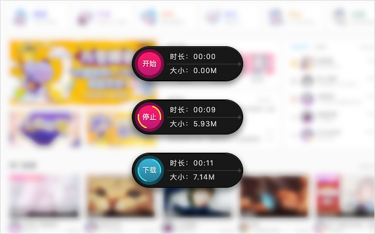

# :watermelon: Chrome 扩展 - Bilibili 录播姬

> 一键录制 Bilibili 直播间视频，不用错过主播的精彩时刻。

## 安装

-   [在线 chrome 网上应用商店](https://chrome.google.com/webstore/detail/nagmkdppcmenlcgelpgkjoknakghllml)
-   [离线 dist 目录](./dist/)

## 注意

目前扩展处于测试阶段，不能保证所有视频都能成功录制，遇到问题提`issues`时可以把你的完整操作步骤描述出来。

## 支持

其实以下直播平台都支持录制，但本扩展由于不想申请过多域名权限，所以暂不打算把这些的直播平台全部加进来，假如你想添加你想要的平台可以自行添加到 [manifest.json](./src/manifest.json) 并打包。

| 直播平台   | 域名权限                  | 内置支持           |
| ---------- | ------------------------- | ------------------ |
| B 站直播   | `*://live.bilibili.com/*` | :white_check_mark: |
| 企鹅电竞   | `*://egame.qq.com/*`      | :white_check_mark: |
| 战旗直播   | `*://*.zhanqi.tv/*`       | :white_check_mark: |
| 龙珠直播   | `*://*.longzhu.com/*`     | :x:                |
| CC 直播    | `*://cc.163.com/*`        | :x:                |
| 快手直播   | `*://live.kuaishou.com/*` | :x:                |
| 映客直播   | `*://*.inke.cn/*`         | :x:                |
| NOW 直播   | `*://now.qq.com/*`        | :x:                |
| 火猫直播   | `*://*.huomao.com/*`      | :x:                |
| 来疯直播   | `*://*.laifeng.com/*`     | :x:                |
| 爱奇艺直播 | `*://live.iqiyi.com/*`    | :x:                |
| 西瓜直播   | `*://live.ixigua.com/*`   | :x:                |

## 使用

进入直播间，留意页面右上角的浮标，点击开始进行录制，任意时间后点击停止，最后点击下载即可

## 截图

## 代办

-   无刷新开始录制
-   修正录制后的时间戳
-   预缓存开始录制前的视频

## 问题

#### 为什么开始录制后要刷新页面？

因为直播的数据流好像不支持从中间截取出来，必须要带有完整的数据流，或许后面可以找到更好的方法无刷新截取部分视频。

#### 为什么安装插件时提示要获取浏览历史记录？

因为这是的`content-security-policy`响应头引起的，这个响应头为了安全起见而限制了加载资源的来源，我这个插件处理数据的时候需要用到`blob`地址格式的`worker`，直播平台也把种资源禁止掉了，我只好获取请求权限去修改了这个请求头，而并非真的要获取浏览记录，这部分代码在`src/background/dev/index.js`里。

#### 为什么录制会突然中断？

因为视频流必须是一个完整的数据，假如录制开始后，发生了切换画质或者线路，又或者网络不好导致直播的心跳重连，都会引起视频流异常而导致中断，但你依旧可以下载中断前的视频数据。

#### 为什么视频显示的时间不对？

因为视频流的时间是按照主播开播的时间来定义的，我尝试去修正成本视频的实际时间，我还没找到修改时间戳的办法，不过你可以把视频再在本地用转格式软件转一下而修正时间戳，而且还可以压缩大小。

## 捐助

## 交流

## License

MIT © [Harvey Zack](https://sleepy.im/)
